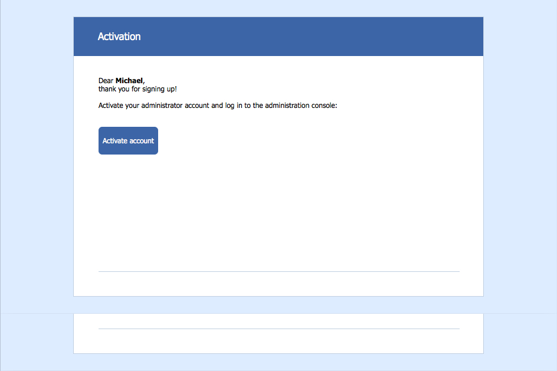
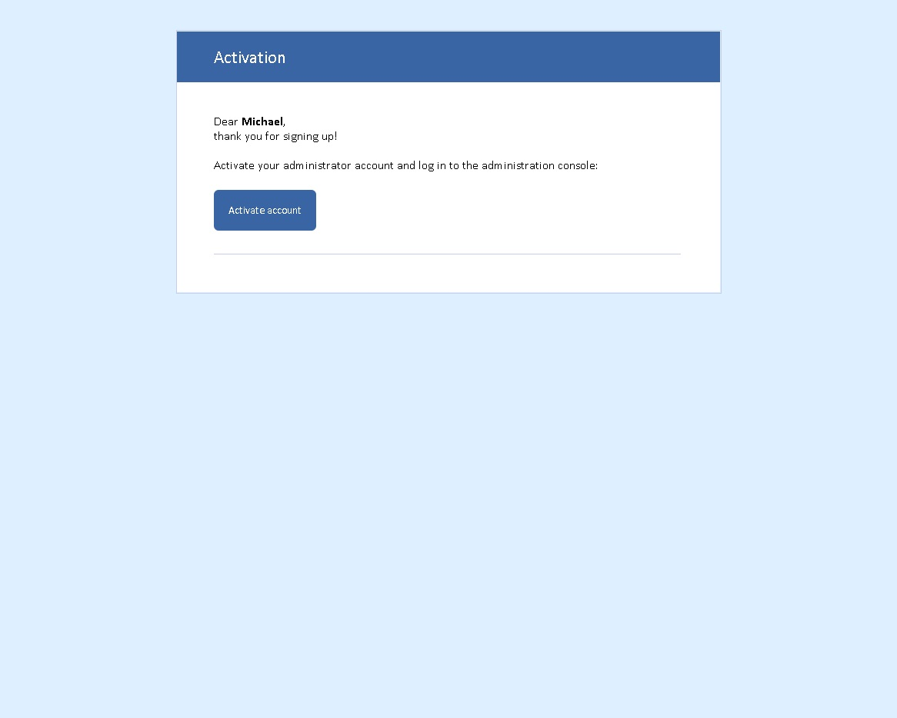

### An example of the activation page (cross program implementation with rounded corners)

[Result of work](http://htmlpreview.github.io/?https://github.com/apoterenko/coding-style/blob/master/html/email-rounded-button-template/activation/src/index.html)

##### Apple Mail

##### iPhone 5S (iOS 8)
.png)

##### iPhone 6+ (iOS8)
.png)

##### Outlook 2013

##### Outlook.com IE 11 (win).png
.png)

##### Thunderbird

##### Yahoo! IE 11 (win)
.png)