## The examples of the emails templates

[The update email template](http://htmlpreview.github.io/?https://github.com/apoterenko/coding-style/blob/master/html/email-templates/src/email-update.html)

[The quota template](http://htmlpreview.github.io/?https://github.com/apoterenko/coding-style/blob/master/html/email-templates/src/backup.html)

[The backup template](http://htmlpreview.github.io/?https://github.com/apoterenko/coding-style/blob/master/html/email-templates/src/quotas.html)

### iPhone 5S (iOS 8)
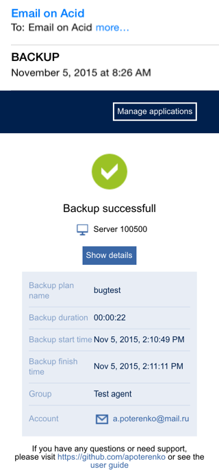

### iPhone 6+ (iOS8)
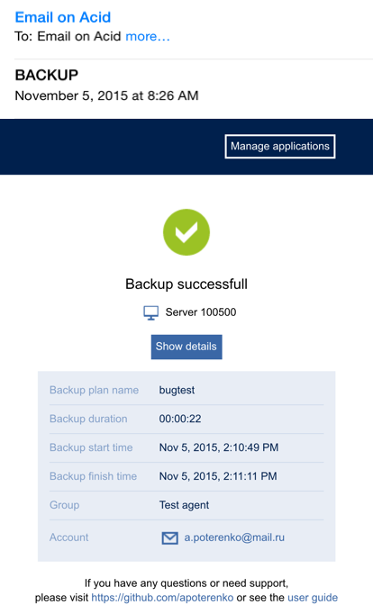

### iPad Retina (iOS 8)
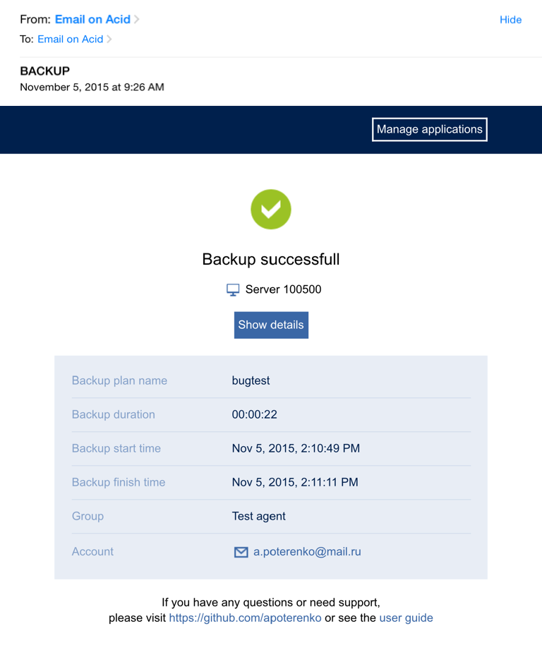

### Outlook 2013
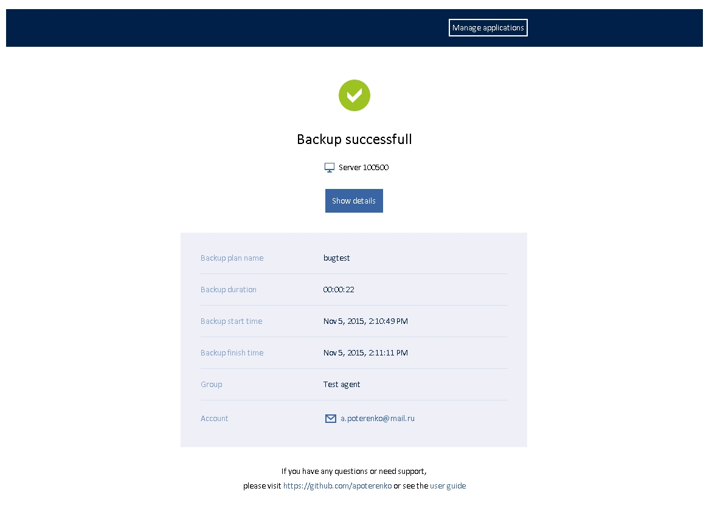

### Thunderbird
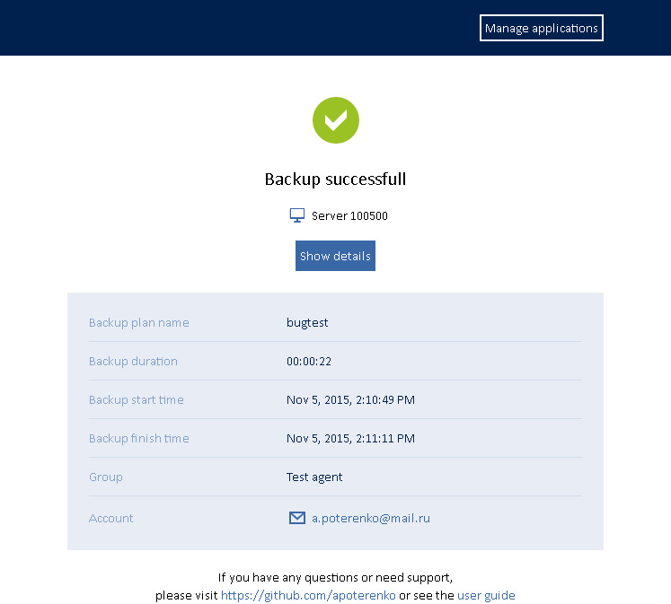

### Office 365 Chrome (win)
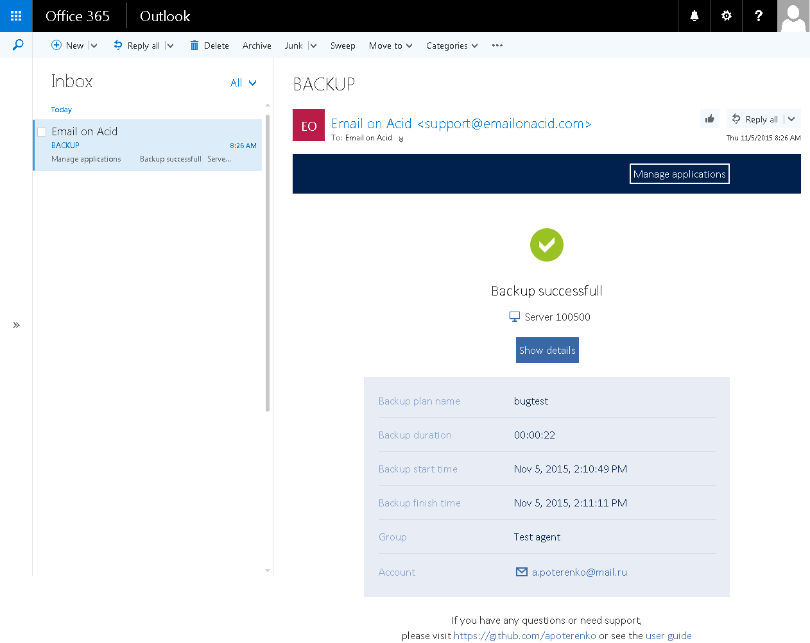

### Apple Mail 8
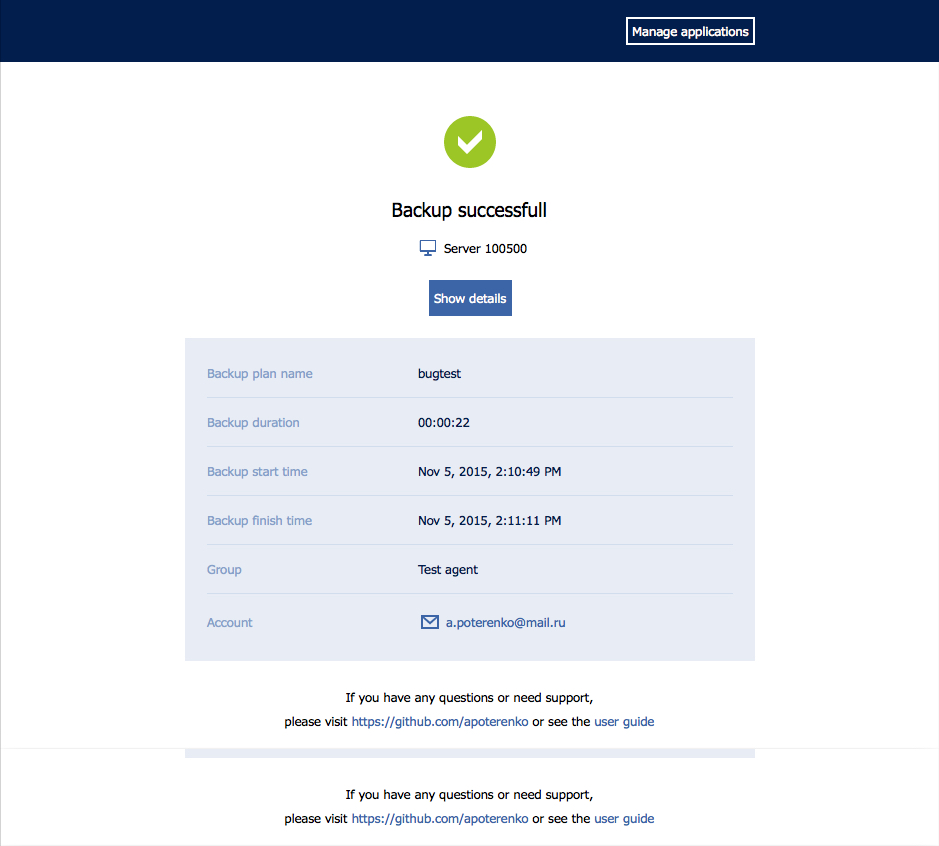

### Android 4.4.4
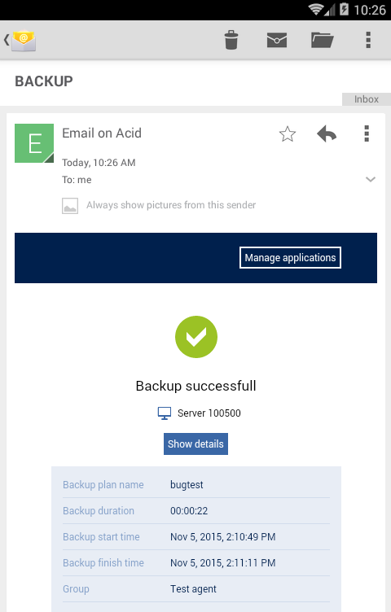

### Outlook.com IE 11 (win)
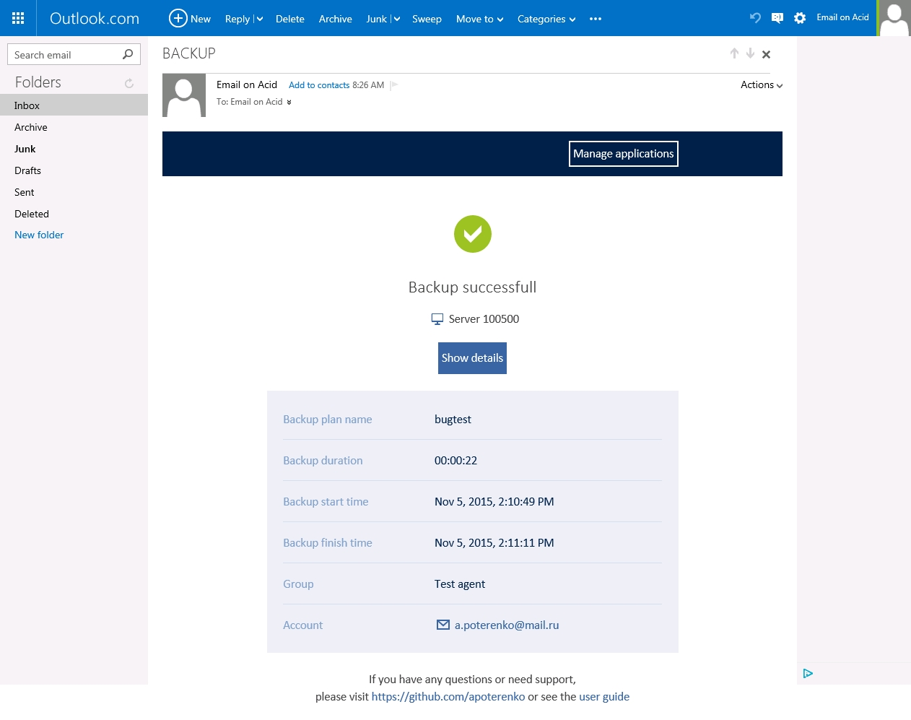

### Outlook.com Firefox (win)
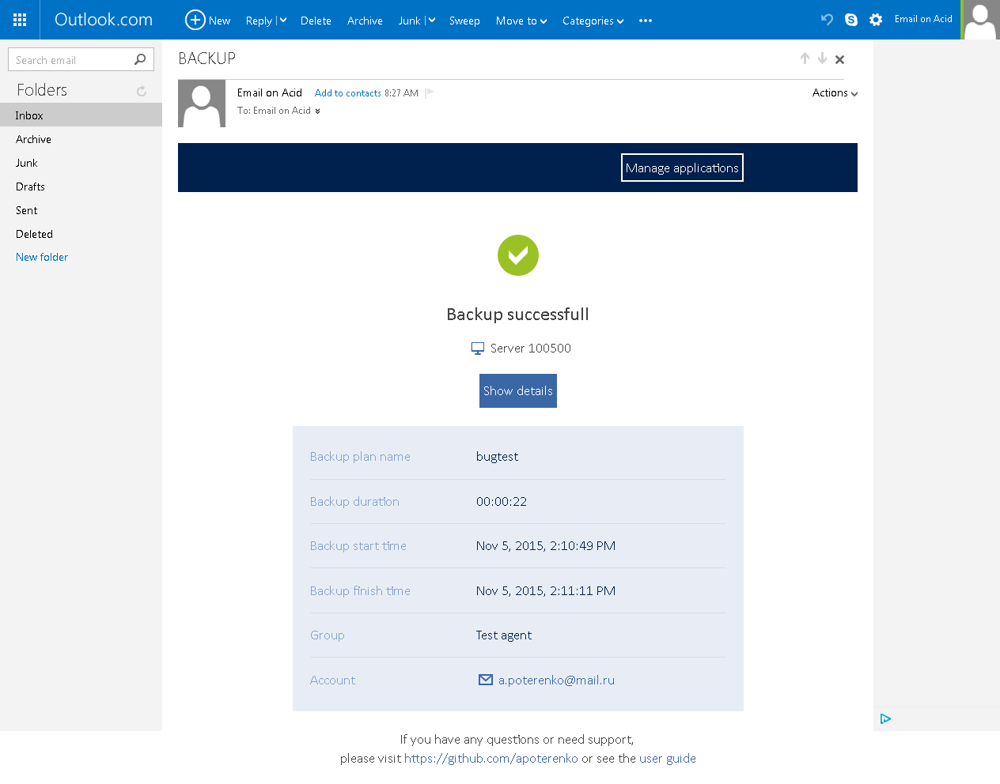

### Gmail IE 11 (win)
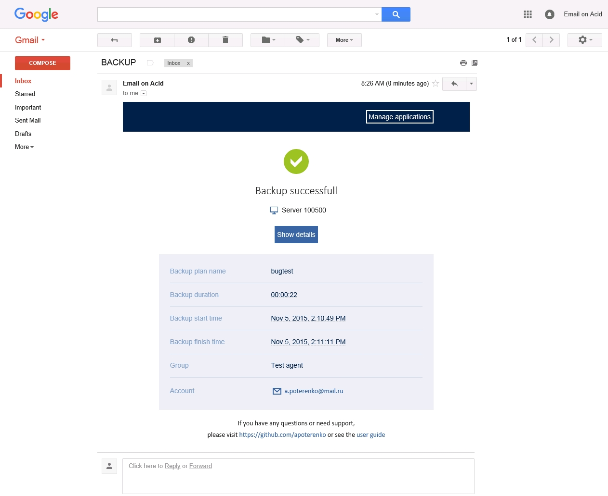